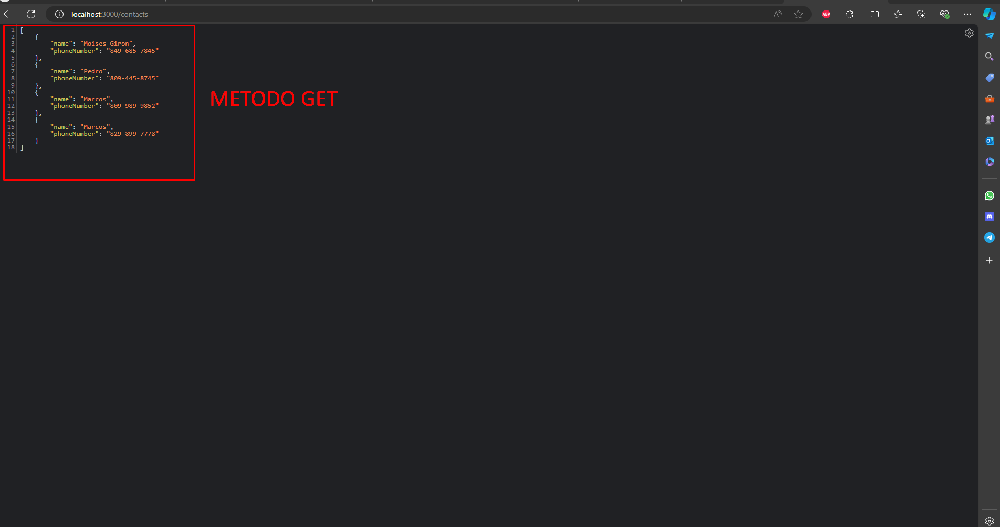
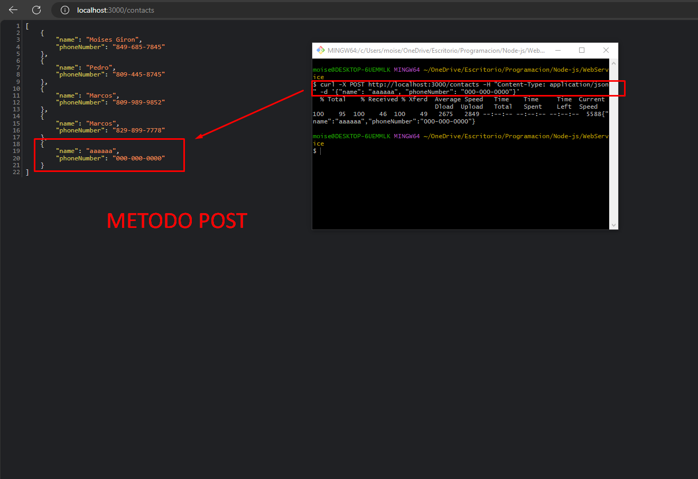

# Tarea #5 Web Service (API) con Node.js
Moises Giron Arias #2023-0211

## Libreria utilizadas
- Express Node.js

## EndPoints
- GET : contacts
- POST : contacts {body}

# Programa en funcionamiento

### Endpoint GET

### Endpoint POST

